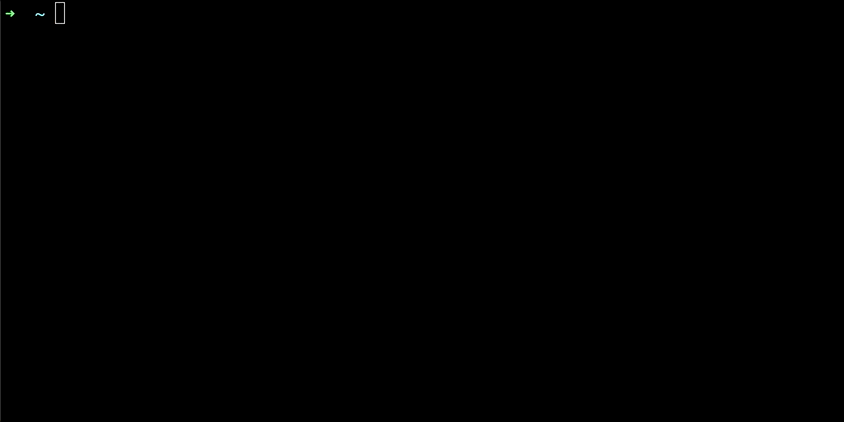

# brain-cli

This is a rust cli (command line interface) program I developed to let users save things they need to reference later.

This is the 🥈`second (v2)` less bare bones version.
## Usage/Features:
Invoke the Brain with `brain`
```
brain
🧠 (Brain): What do you want to remember?
....{your response}..
```
^ This saves the contents to `$HOME/.brain-cli/brain.md` or if `$HOME` does not exist, it saves it to the `./.brain-cli/brain.md` current dir

Other commands:
```
# list the brain file in the terminal (with some minimal markdown highlighting)
brain list

# print out the location of the brain file on your computer
brain location

```


# Why?
I find there are many things I want to remember, but not a super easy way to just dump them somewhere formatted nicely. 
So this is an attempt at just dumping things I need to refer back to later.

# What it looks like:


## Installation
**Prereq:** Need to have rust/cargo installed [instructions here](https://doc.rust-lang.org/book/ch01-01-installation.html)

```
git clone https://github.com/goshipcode/brain-cli.git
cd brain-cli
cargo run 
```

## How to add this binary to your path in macos and linux
```
# First create a release version of the binary
cargo build --release

# Now copy the binary to a bin directory of your choice:
cp target/release/brain [directory of your choice]/bin
chmod 755 [directory of your choice]/bin/brain

# Add the binary to your path
export PATH="[directory of your choice]/bin:$PATH"

# Now you can execute `brain` from your terminal:
brain 
```

